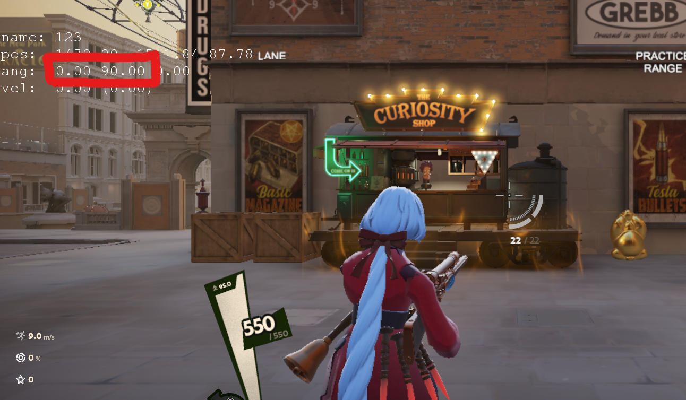
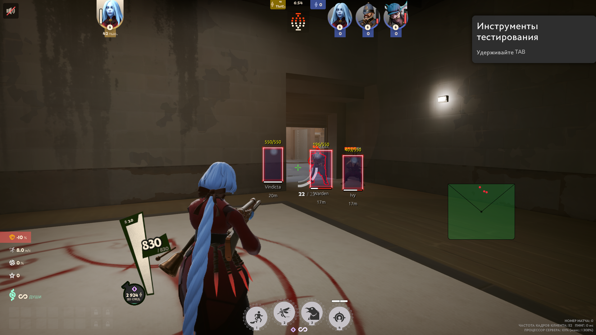
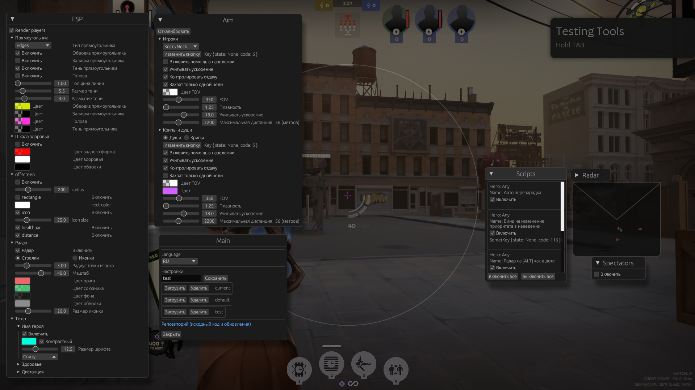
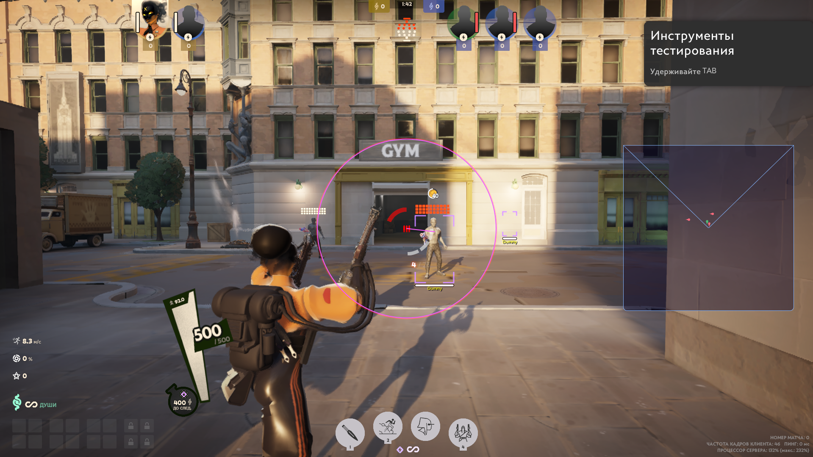
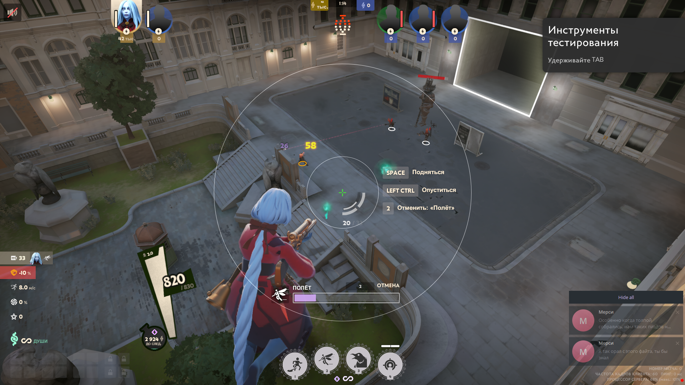

<h1 align="center">
      deadlock-esp
</h1>

> [!WARNING]
> The use of cheat programs is strictly prohibited by Gaben. This may result in your account being banned!<br>
> If you care about your account, then do not use any cheats, including this one

Report your problem: https://github.com/Loara228/deadlock-esp/issues/new<br>
Offset changes: https://github.com/Loara228/deadlock-esp/issues/18

## How to use

0. Install [Rust](https://www.rust-lang.org/ru/learn/get-started) and [Cargo](https://doc.rust-lang.org/cargo/getting-started/installation.html)
1. Clone repository
1. Change the program name in the [toml file](https://github.com/Loara228/deadlock-esp/blob/master/Cargo.toml)

```txt 
name = "{example}"
```

> [!NOTE]
> If desired, you can disable the console

```rs
#![cfg_attr(not(debug_assertions), windows_subsystem = "windows")]
```

3. Compile it:

```txt
cargo build --release
```

4. Start the game
5. Run the cheat

```txt
./{example}
```

6. To open and close the overlay, use the <kbd>HOME</kbd> key
7. If you have problems with the overlay, then try to run it like this

```txt
./{example} --old-window
```

8. Calibrate as shown in the picture



<hr>

<details>
<summary>Features</summary>

+ Aimbot
   - Targets:
      - Players:
         - Head / Neck / Chest / Pelvis
      - Souls, creeps
      - Priority selection
   - Takes target speed into account
   - Recoil Control System (RCS)
   - Customizable FOV
      - Distance
      - Color
   - Settings for maximum distance
+ Radar
   - Scaling
   - Colors
   - Size, position
   - Player directions
   - Player icons
+ Player ESP
   - Boxes (player rectangle)
      - Outline type:
         - Normal
         - Rounded
         - Corners
      - Outline
      - Outline shadow
      - Customizable colors and outline shadow
   - Head
   - Player health bar
      - Icons
      - Color settings
      - Dynamic width adjustment
   - Labels
      - Displays:
         - Health
         - Hero name
         - Distance in meters
      - Positioning
      - Contrast
      - Font size
+ Offscreen
   - Health
   - Distance
   - Icon
+ Configuration file
   - Save / Load
+ Observer list
   - Shows who is watching you
   - Shows who else is watching with you
+ Localization
   - Vietnamese (Nuoc mam edition) --Soon
   - English (Hamburger edition)
+ Scripts
   - Shiv - A script for ults (works only with quick casts). Displays low health threshold and uses ult (works poorly).
   - Vindicta - A script for ults. Quick shot.
   - Active Reload - A script for pressing reload at the right moment, works when the "Active Reload" item is present.
   - Entity priority switching - Press <kbd>F5</kbd> to change targeting priority (Creeps / Souls).
   - RadarToggle - Hold <kbd>ALT</kbd> to display hero icons on the radar (as in Dota).
   - Movement - Hold <kbd>CTRL</kbd> to perform a sliding jump with a slight acceleration to maintain speed. <kbd>G</kbd> - Dash.

</details>

## Other Details
   - Overlay cycle does not work when the game window is inactive.
   - Does not use WriteProcessMemory.
   - Mouse events are sent from a separate process.
   - Auto-update of pointers from the game's module memory.

## How to Add Your Own Script

You can use this interface to create your own script.

The **update** function is used to write the logic of our code. It accepts external game data, the current state of the key, and configuration settings.

The **draw** function is responsible for rendering on the screen and displaying notifications.

The **hero_id** method returns the ID of the hero for which the script will be executed. If you specify _Hero::None_, the script will work for all heroes.

To specify the key that will be used when executing the script, the **init_key_code** method is provided. This method is called only during script initialization, and its value cannot be changed while the program is running. If your script does not require a key press, return _None_. The key is specified as an integer (i32), but for convenience, you can use VirtualKeys.

```rs
#[derive(Default)]
pub struct MyScript {...}
impl HeroScript for MyScript {
    fn update(&mut self, game_data: &External, script_key: KeyState, settings: &mut Settings) {...}
    fn draw(&mut self, g: &egui::Painter, game_data: &External, toasts: &mut Toasts) {...}
    fn hero_id(&self) { Hero::Vindicta }
    // Name to be displayed in the UI
    fn name(&self) -> &str { "My script!" }
    // Key. Return None if no key is needed
    fn init_key_code(&self) -> Option<i32> { Some(VirtualKeys::KEY_F1 as i32) }
}
```

Next, go to the overlay constructor and add your script:
> src>external>scripts>mid.rs>get_scripts() -> Vec<(Arc<Mutex<dyn HeroScript>>, HeroScriptSettings)>

```rs
pub fn get_scripts() -> Vec<(Arc<Mutex<dyn HeroScript>>, HeroScriptSettings)> {
    vec![
        (Arc::new(Mutex::new(MyScript::default())), HeroScriptSettings::default())
    ]
}
```

<hr>

<!-- ## Offsets

<div align="left">
<b>
      <a href="https://github.com/Loara228/deadlock-esp/blob/master/offsets/client_dll.cs">cs💜</a> | 
      <a href="https://github.com/Loara228/deadlock-esp/blob/master/offsets/client_dll.hpp">cpp💀</a> | 
      <a href="https://github.com/Loara228/deadlock-esp/blob/master/offsets/client_dll.rs">rs🦀</a>
      (больше не обновляю)
</b>
</div>

Relevant offsets used in the project - [тык](https://github.com/Loara228/deadlock-esp/blob/master/src/external/offsets/mod.rs) -->

## Pictures









<div align = "center">

</div>

<a href="https://www.youtube.com/watch?v=3nJs6GPmEZs"><sub><sub>💪старый бог💪</sup></sub></a>

